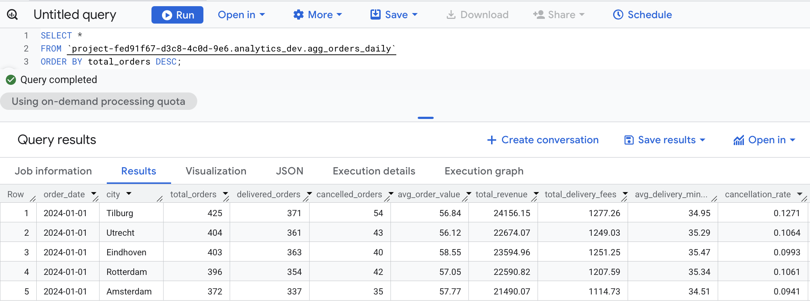

# Food Delivery Analytics Platform (GCP)

An end-to-end data engineering project that simulates a food-delivery platform and builds an analytical data pipeline using modern cloud tools.

This project is designed to reflect real-world data workflows used in marketplace and logistics companies.

---

## 📌 Project Goals

- Simulate realistic food-delivery order data
- Ingest raw data into BigQuery
- Transform data using dbt
- Orchestrate pipelines with Airflow
- Build analytical dashboards in Looker
- Follow production-style data modeling and validation practices

---

## 🏗️ Architecture Overview

```text
Python Data Generator
        |
        v
   CSV / GCS
        |
        v
   BigQuery (Raw Layer)
        |
        v
   dbt (Staging + Marts)
        |
        v
   Looker Dashboards


## Data Pipeline Validation

### Warehouse Structure


### Business Metrics Output



### Data Quality Tests (dbt)

All 52 tests passed — ensuring reliability and correctness of the data pipeline.


