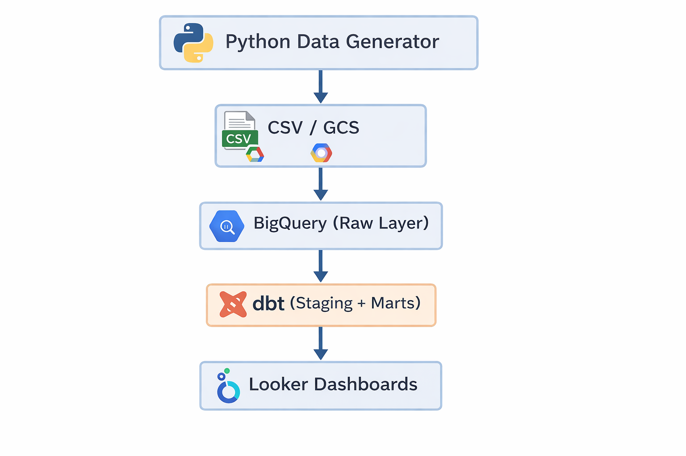
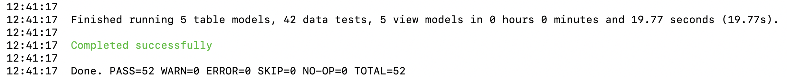
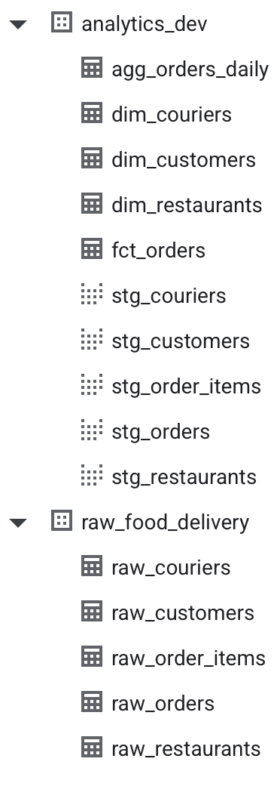
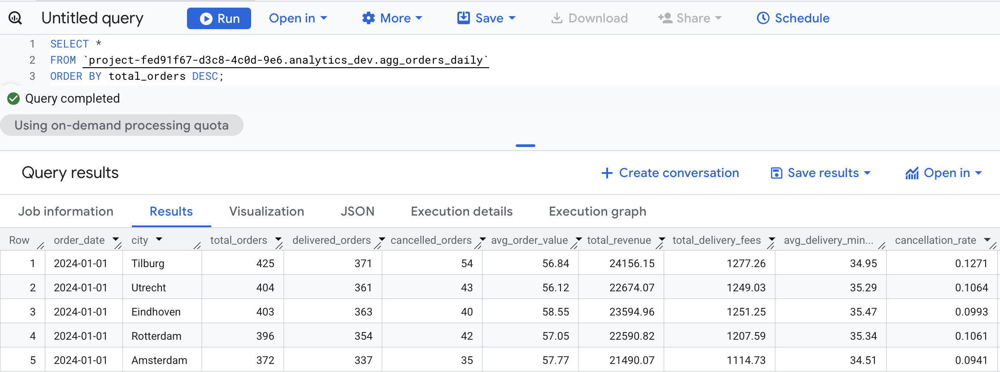
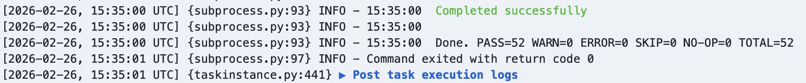
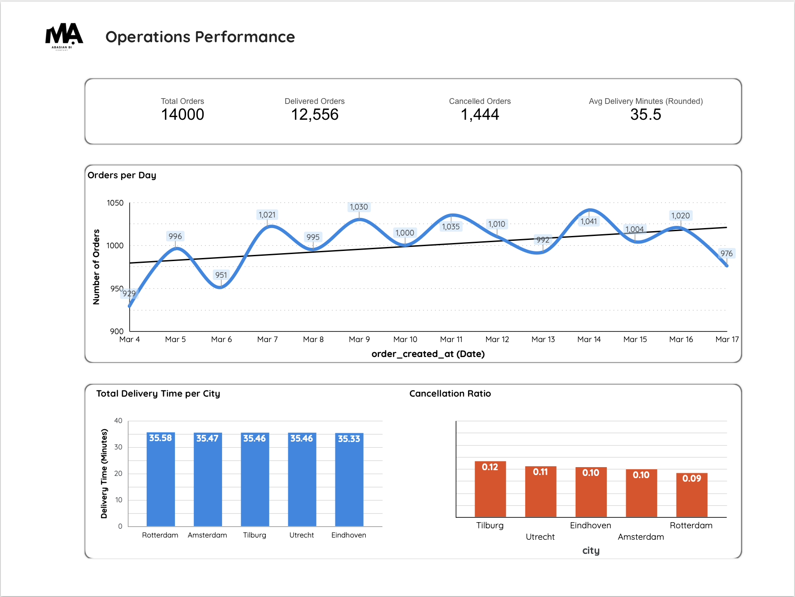
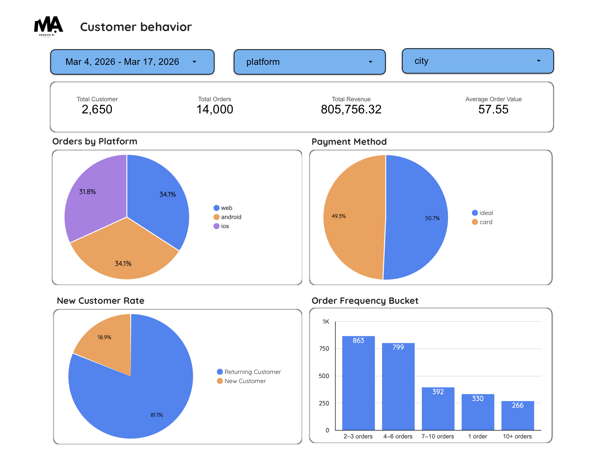
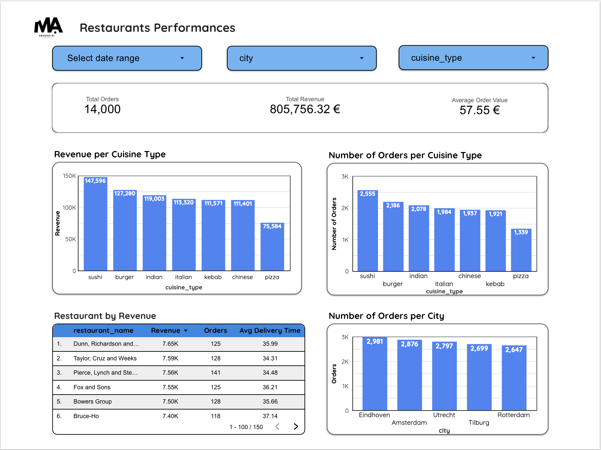

# Food Delivery Analytics Platform (GCP)

An end-to-end data engineering project that simulates a food-delivery platform and builds an analytical data pipeline using modern cloud tools.

This project is designed to reflect real-world data workflows used in marketplace and logistics companies.

---

##  Project Goals

- Simulate realistic food-delivery order data
- Ingest raw data into BigQuery
- Transform data using dbt
- Orchestrate pipelines with Airflow
- Build analytical dashboards in Looker
- Follow production-style data modeling and validation practices

---

##  Tech Stack

- Python (data simulation)
- Google BigQuery (data warehouse)
- dbt (transformations & testing)
- SQL (analytics & modeling)
- Google Cloud Platform (GCP)

---

## Project Structure

The repository is organized to reflect a typical production-style data engineering project.

food-delivery-analytics-platform/

```text

├── airflow/                     # Pipeline orchestration
│   ├── dags/
│   │   └── food_delivery_pipeline.py
│   ├── config/
│   └── docker-compose.yml
│
├── data_simulator/              # Synthetic data generator
│   ├── generate_data.py
│   └── requirements.txt
│
├── dbt/                         # dbt configuration
│   └── profiles/
│       └── profiles.yml
│
├── food_delivery/               # dbt project
│   ├── dbt_project.yml
│   ├── macros/
│   └── models/
│       ├── staging/
│       │   ├── stg_orders.sql
│       │   ├── stg_customers.sql
│       │   ├── stg_restaurants.sql
│       │   ├── stg_couriers.sql
│       │   └── stg_order_items.sql
│       │
│       └── marts/
│           ├── core/
│           │   ├── dim_customers.sql
│           │   ├── dim_restaurants.sql
│           │   ├── dim_couriers.sql
│           │   └── fct_orders.sql
│           │
│           └── analytics/
│               ├── fct_orders_enriched.sql
│               └── agg_orders_daily.sql
│
├── bq_queries/                  # Validation queries
│   ├── 01_row_counts.sql
│   ├── 02_join_integrity.sql
│   ├── 03_delivery_time_stats.sql
│   ├── 04_orders_by_city.sql
│   └── 05_payment_distribution.sql
│
├── db_docs/                     # Design & documentation
│   ├── data_design.md
│   ├── data_schema.md
│   ├── bigquery_plan.md
│   └── sprint_notes.md
│
├── docs/                        # Architecture diagrams & results
│   ├── Architecture_Overview.png
│   ├── architecture_bigquery.png
│   ├── analytics_result.png
│   ├── airflow_pipeline_success.png
│   └── dbt_tests.png
│
├── README.md
└── requirements.txt

```

##  Architecture Overview



## Layers Explained

### Raw Layer
Simulated operational data loaded into BigQuery:

- raw_customers
- raw_restaurants
- raw_couriers
- raw_orders
- raw_order_items

### Staging Layer

- Clean raw data
- Standardizes column names
- Applies data quality tests
- Built as dbt views

Example models:
- stg_customers
- stg_orders
- stg_order_items

### Core Layer (Star Schema)
Implements dimensional modeling:

#### Fact Table
- fct_orders

#### Dimension Tables
- dim_customers
- dim_couriers
- dim_restaurants

This layer follows a classic **star schema design**, a dimensional modeling approach widely used in modern data warehouses to support analytical workloads.

### Analytics Layer
Business-ready aggregated tables:
- agg_orders_daily

Provides:
- Total orders
- Delivered / cancelled orders
- Average order value
- Total revenue
- Average delivery time
- Cancellation rate

## Data Volume (Simulated)
The pipeline processes:
- 3500 customers
- 150 restaurants
- 250 couriers
- 1000 orders per day

All data is generated programmatically and loaded into BigQuery.

## Data Pipeline Validation

### Automated Data Quality Testing
The warehouse includes **42+ dbt data tests**, covering:
- Not-null constraints
- Uniqueness constraints
- Accepted values validation
- Primary key integrity
- Aggregation validation

### Data Pipeline Validation

**dbt Build Result**

All tests passed successfully:



This ensures the pipeline is reliable and production-ready.

### BigQuery Warehouse Structure

<p align="left">
  
</p>
### Aggregated Analytics table

Example query:



## Airflow Orchestration

The entire pipeline is orchestrated using Apache Airflow.

The DAG performs:

1. Data generation
2. Loading raw data into BigQuery
3. Running dbt build (models + tests)

The pipeline was executed multiple times successfully, proving idempotency and reproducibility.



## Data Engineering Architecture Decisions

This project follows several architectural patterns commonly used in modern data platforms.

### ELT over ETL

The pipeline follows an **ELT (Extract–Load–Transform)** approach:

1. Raw data is first loaded directly into BigQuery.
2. Transformations are then performed inside the warehouse using dbt.

This approach leverages the scalability of cloud data warehouses and simplifies pipeline design.

### Layered Data Architecture

The warehouse follows a layered structure:

- **Raw Layer** – Operational data ingested into BigQuery
- **Staging Layer** – Cleaned and standardized dbt models
- **Core Layer** – Star schema with fact and dimension tables
- **Analytics Layer** – Aggregated tables used for BI dashboards

This structure improves data maintainability, testing, and scalability.

### Dimensional Modeling

The core warehouse layer uses a **star schema**, consisting of:

- `fct_orders` as the main fact table
- `dim_customers`, `dim_restaurants`, and `dim_couriers` as dimension tables

Dimensional modeling enables fast analytical queries and simplifies BI reporting.

### Transformation Management with dbt

dbt was used to:

- Organize SQL transformations as modular models
- Implement automated data tests
- Manage dependencies between transformations
- Build reproducible analytics datasets

This approach enables version-controlled, testable data transformations.

### Pipeline Orchestration

Apache Airflow orchestrates the full pipeline:

1. Generate synthetic operational data
2. Load data into BigQuery
3. Execute dbt models and tests

This simulates how production pipelines are scheduled and monitored in real-world platforms.

## Production Considerations

Although this project uses simulated data, the pipeline is designed to follow patterns used in real-world data platforms.

### Idempotent Pipelines

The Airflow DAG can be executed multiple times without corrupting the warehouse.  
Each run regenerates data and rebuilds the transformation layer, ensuring consistent and reproducible outputs.

### Automated Data Quality Testing

The warehouse includes **42+ automated dbt tests**, validating:

- Primary key uniqueness
- Not-null constraints
- Accepted values
- Data integrity between fact and dimension tables

This ensures analytical tables remain reliable for downstream consumption.

### Modular Data Modeling

The transformation layer follows a **layered dbt architecture**:

- **Raw Layer** — Ingested operational data
- **Staging Layer** — Cleaned and standardized models
- **Core Layer** — Star schema with fact and dimension tables
- **Analytics Layer** — Aggregated business metrics

This modular design improves maintainability and scalability.

### Reproducible Data Builds

The warehouse can be rebuilt end-to-end using a single command:

dbt build

Combined with Airflow orchestration, this ensures the entire pipeline can be executed automatically and consistently.

## Analytics Dashboards (Looker Studio)

To demonstrate how the data platform supports business analytics, three interactive dashboards were built in Looker Studio using the analytics tables produced by dbt.

These dashboards simulate how marketplace and delivery companies monitor operational performance, customer behavior, and restaurant activity.

---

### Operations Performance Dashboard

This dashboard tracks the operational health of the delivery platform.

Key metrics include:

- Total orders
- Delivered vs cancelled orders
- Average delivery time
- Daily order volume trends
- Delivery performance by city
- Cancellation ratios



---

### Customer Behavior Dashboard

This dashboard analyzes customer ordering patterns and purchasing behavior.

Key insights include:

- Total customers and orders
- Revenue and average order value
- Orders by platform (Web / Android / iOS)
- Payment method distribution
- New vs returning customers
- Order frequency distribution



---

### Restaurant Performance Dashboard

This dashboard evaluates restaurant performance across the platform.

Key analytics include:

- Revenue per cuisine type
- Orders per cuisine category
- Top restaurants by revenue
- Orders by city
- Average delivery time by restaurant




## How to Run the Project

### Generate Data
- python data_simulator/generate_data.py

### Build Warehouse
- cd food_delivery
- dbt build

## Key Engineering Concepts Demonstrated
- Cloud data warehousing (BigQuery)
- Modern ELT workflow
- dbt transformations
- Data validation & testing
- Star schema modeling
- Analytical aggregations
- Reproducible pipelines

## Author

**Mahan Abasian**

Master’s in Data Science & Society

Focused on Data Engineering & Cloud Analytics
